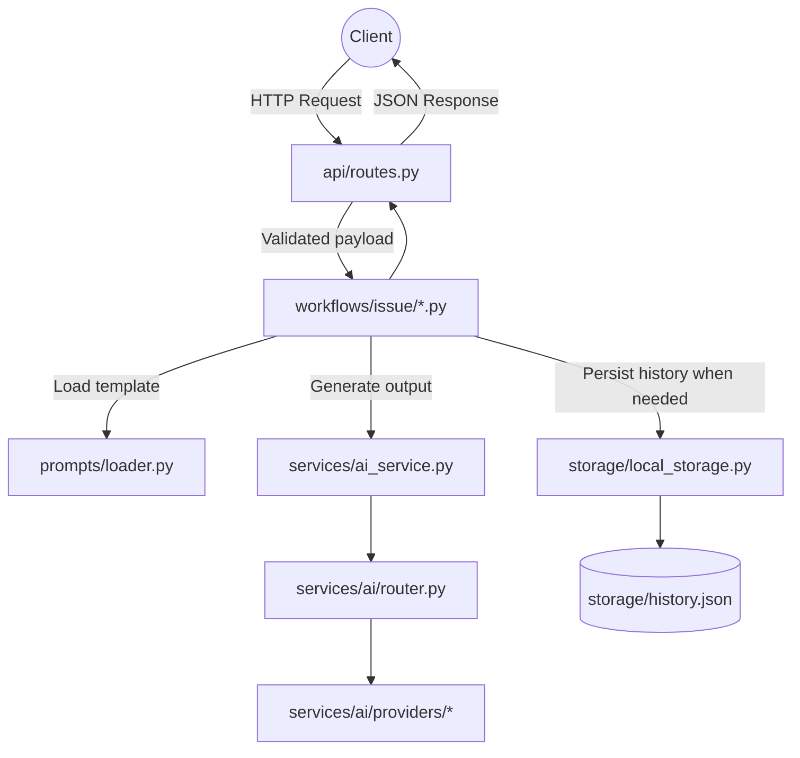

# DEPENDENCY_FLOW.md

Dokumen ini menjelaskan bagaimana modul utama dalam backend saling berinteraksi.

## Diagram Aliran

## Hubungan Penting

1. **API ↔ Workflows**: Endpoint hanya meneruskan data tervalidasi ke workflow yang sesuai.
2. **Workflows ↔ Prompts**: Workflow memuat template prompt dari `prompts/issue/*.txt`.
3. **Workflows ↔ AI Services**: Workflow tidak boleh tahu detail provider; cukup memakai facade/gateway.
4. **AI Router ↔ Providers**: Router menentukan provider aktif, fallback, dan registry lookup.
5. **Workflows ↔ Storage**: Hanya workflow yang relevan menyimpan history, bukan router atau provider.

## Rantai Dependensi yang Perlu Dijaga

- `api/routes.py` -> `workflows`
- `workflows` -> `prompts` + `services` + `storage`
- `services/ai_service.py` -> `services/ai/facade.py` -> `services/ai/router.py`
- `storage/local_storage.py` -> `core/config.py`

## Batasan Dependensi

- `api/` tidak boleh langsung mengakses `storage/history.json`
- `api/` tidak boleh langsung memanggil provider adapter
- `services/` tidak boleh mengatur HTTP response
- `providers/` tidak boleh mengetahui workflow bisnis
