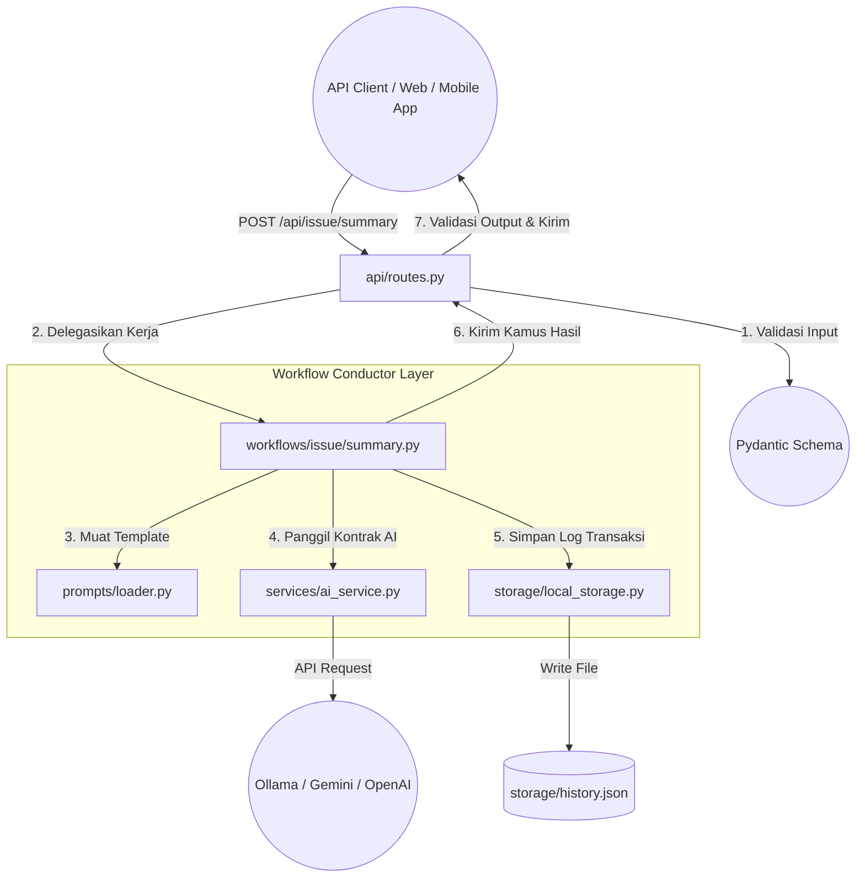

# 🏗️ SYSTEM_ARCHITECTURE.md
> **Arsitektur & Model Aliran Sistem - `CIVILIZATION GROUP PROJECT`**
>
> Dokumen ini mendefinisikan struktur tingkat tinggi, tanggung jawab layer, dan aliran data dalam project **Operational Workflow API Backend**.

---

## 🚀 1. Modern Tech Stack

Sistem ini dirancang sebagai API Backend stateless (tanpa state) yang super cepat, modular, dan terstruktur rapi untuk dipasangkan dengan frontend atau integration client apapun (Client Web, Mobile App, Postman, atau Layanan Pihak Ketiga).

* **Language**: Python 3.10+
* **Framework**: [FastAPI](https://fastapi.tiangolo.com/) (Asynchronous, High-Performance Web API)
* **Data Validation**: [Pydantic v2](https://docs.pydantic.dev/) (Validasi tipe data input/output otomatis dan dokumentasi OpenAPI/Swagger)
* **AI Engines**: Agnostik & Modular (Mendukung integrasi local **Ollama Qwen2.5**, **Google Gemini AI**, dan **OpenAI GPT**)
* **Database / Storage**: 
  - `storage/history.json`: Penyimpanan log riwayat pengerjaan lokal (ringan & cepat).
* **Server**: `Uvicorn` (ASGI web server).

---

## 🔄 2. Aliran Data & Orkestrasi (Loose Coupling)

Sistem ini menerapkan prinsip **Loose Coupling** dan **Single Responsibility** yang ketat melalui pola **Workflow Conductor**.

---

## 📁 3. Pembagian Tanggung Jawab Folder (Folder Responsibility)

Setiap direktori memiliki tanggung jawab yang terisolasi dengan ketat. Modul di dalam satu folder dilarang keras melompati batas layer untuk menjaga kemudahan pemeliharaan (*maintainability*).

### 🛠️ `api/` (Lapisan Interface & Validasi)
* **Tanggung Jawab**: Mendefinisikan endpoint API, mengelola parameter routing HTTP, memvalidasi input data JSON dari client menggunakan Pydantic, dan memformat output response.
* **🚫 Batasan Ketat**: **DILARANG** melakukan pemrosesan logika bisnis berat, memanggil API LLM secara langsung, atau melakukan operasi I/O database manual. Tugas router hanyalah menerima, memvalidasi, mengoper ke Workflow, dan mengembalikan hasil.

### 🎮 `workflows/` (Lapisan Konduktor & Logika Bisnis)
* **Tanggung Jawab**: Berperan sebagai "Dirigen" (Conductor) yang mengatur koordinasi antar komponen. Memuat prompt, memformat data, memanggil layanan AI, dan memicu penyimpanan data.
* **🚫 Batasan Ketat**: **DILARANG** berurusan dengan protokol HTTP, status code API, atau UI layout. Lapisan ini murni logis dan agnostik terhadap client yang memanggilnya.

### 🧠 `services/` (Lapisan Integrasi Pihak Ketiga)
* **Tanggung Jawab**: Mengelola integrasi dengan Large Language Model (LLM) melalui Interface/Contract.
* **🚫 Batasan Ketat**: **DILARANG** mengetahui alur bisnis utama. Service hanya bertugas menerima teks input bersih, memanggil model LLM yang aktif, dan mengembalikan string jawaban mentah.

### 📝 `prompts/` (Lapisan Instruksi AI)
* **Tanggung Jawab**: Menyimpan berkas template prompt mentah dalam format `.txt`. Hal ini memisahkan instruksi LLM dari kode Python utama agar mudah di-tuning oleh developer/prompt engineer tanpa menyentuh kode program.

### 💾 `storage/` (Lapisan Database & Persistensi)
* **Tanggung Jawab**: Menyimpan riwayat transaksi ke file JSON lokal (`history.json`).
* **🚫 Batasan Ketat**: Seluruh pembacaan dan penulisan database lokal wajib melalui kelas pembantu di folder ini. Layer lain dilarang memanipulasi file JSON secara manual.

---

## 🛡️ 4. Aturan Arsitektur untuk Pengembang & AI Agents

1. **Strict Asynchronous Integration**: Seluruh operasi network I/O wajib non-blocking. Meskipun model lokal saat ini berjalan sinkron untuk kemudahan testing offline, struktur integrasi dirancang untuk skalabilitas asinkron penuh.
2. **Contract-First Services**: Setiap service baru (seperti model AI baru) wajib mengimplementasikan interface kontrak yang didefinisikan oleh `BaseAIService`.
3. **No Direct Storage Access**: Komponen `api/` atau `services/` dilarang keras mengakses berkas JSON di `storage/` secara langsung. Selalu gunakan adapter dari `storage/local_storage.py`.
4. **FastAPI Error Isolation**: Selalu tangkap exception bisnis di dalam Router dan bungkus dengan `HTTPException` standar FastAPI untuk memastikan API mengembalikan pesan kesalahan yang rapi dan seragam kepada client.
