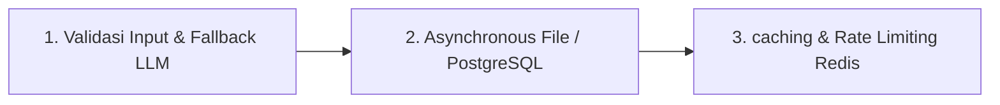

# 🗂️ SYSTEM_FEATURE_MAP.md
> **Peta Fitur, Indeks Kode & Batasan Teknis Sistem**
>
> Dokumen ini memetakan fitur-fitur operasional sistem ke berkas implementasi aslinya, serta mendokumentasikan batasan teknis saat ini dan rencana pengembangan skala besar (roadmap).

---

## 🗺️ 1. Peta Fitur & Pemetaan Berkas (Feature-to-Code Mapping)

Berikut adalah katalog endpoint API aktif yang dapat dikonsumsi oleh client saat ini:

| Nama Fitur / Endpoint | Jenis Request | Tujuan & Alur Bisnis | Berkas Utama yang Terlibat | Tingkat Risiko |
| :--- | :--- | :--- | :--- | :--- |
| **Welcome / Health Check** | `GET /` | Memverifikasi status online server backend, menampilkan daftar endpoint aktif, dan tautan dokumentasi OpenAPI. | `main.py` | **🟢 Rendah** |
| **Legacy Issue Summary** | `POST /api/issue-summary` | Menjaga kompatibilitas client lama dengan response `summary` + `request_id`. | `api/routes.py` `workflows/issue/summary.py` `services/ai_service.py` | **🟡 Sedang** |
| **Issue Summary** | `POST /api/issue/summary` | Menerima teks issue, memprosesnya melalui AI, dan mengembalikan ringkasan satu string. | `api/routes.py` `workflows/issue/summary.py` `prompts/issue/summary.txt` | **🟡 Sedang** |
| **Issue Categorization** | `POST /api/issue/categorize` | Mengklasifikasikan issue ke kategori operasional tertentu. | `api/routes.py` `workflows/issue/categorize.py` `prompts/issue/categorize.txt` | **🟡 Sedang** |
| **Issue Severity** | `POST /api/issue/severity` | Menghasilkan tingkat keparahan issue yang ternormalisasi. | `api/routes.py` `workflows/issue/severity.py` `prompts/issue/severity.txt` | **🟡 Sedang** |
| **Issue Tags** | `POST /api/issue/tags` | Mengekstrak tag-tag penting dari issue. | `api/routes.py` `workflows/issue/tags.py` `prompts/issue/tags.txt` | **🟡 Sedang** |
| **Issue Sentiment** | `POST /api/issue/sentiment` | Mengklasifikasikan sentimen issue. | `api/routes.py` `workflows/issue/sentiment.py` `prompts/issue/sentiment.txt` | **🟡 Sedang** |
| **Audit Logs / Work History** | `GET /api/history` | Mengambil daftar riwayat summary issue yang tersimpan di storage lokal. | `api/routes.py` `storage/local_storage.py` | **🟢 Rendah** |

---

## 📁 2. Indeks Berkas Pendukung (Supporting Files Index)

Di luar kode utama, berikut adalah indeks berkas konfigurasi penting sistem:

* **`prompts/loader.py`**: Mengatur pembacaan dan formatting template prompt.
* **`prompts/issue/*.txt`**: Template prompt per fitur issue seperti summary, categorize, severity, tags, dan sentiment.
* **`storage/history.json`**: Berkas database log JSON lokal yang mencatat `id`, `request_id`, `timestamp`, `original_text`, dan `summary`.

---

## 🛠️ 3. Batasan Sistem Saat Ini (Current Technical Limitations)

Untuk membantu perencanaan arsitektur di masa depan, berikut adalah analisis keterbatasan teknis backend saat ini:

| Keterbatasan Sistem | Dampak Negatif | Risiko | Rekomendasi Solusi |
| :--- | :--- | :--- | :--- |
| **Database File JSON**  (`storage/history.json`) | Kinerja pembacaan/penulisan akan melambat drastis saat ukuran log mencapai ribuan catatan. | **Kuning (Sedang)** | Migrasi ke database relasional seperti **PostgreSQL** atau database dokumen seperti **MongoDB**. |
| **Local File I/O Synchronous** | Potensi terjadinya *race condition* (data tabrakan/tertimpa) saat banyak client memproses keluhan secara bersamaan. | **Merah (Tinggi)** | Gunakan library file asinkron (seperti `aiofiles`) atau gunakan database transaksional ACID. |
| **Single Active AI Service** | Sangat bergantung pada local Ollama (`qwen2.5:1.5b`). Jika engine mati atau overload, server mengembalikan error 500. | **Kuning (Sedang)** | Implementasi mekanisme fallback otomatis (seperti beralih ke **Google Gemini API** atau **OpenAI API** jika local Ollama mati). |
| **Input Length Constraint** | Request dibatasi hingga 4000 karakter, sehingga input di atas batas akan ditolak. | **Kuning (Sedang)** | Pertahankan limit ini atau tambahkan preprocessing/chunking jika kebutuhan berubah. |

---

## 🚀 4. Roadmap & Rencana Skalabilitas (Scaling Roadmap)

Jika API Backend ini ingin dideploy ke server produksi untuk melayani ribuan request harian secara stabil, lakukan langkah-langkah peningkatan arsitektur berikut:

1. **Tahap 1 (Stability & Resiliency)**:
   - Pertahankan validasi `max_length` pada field `text` di skema `IssueRequest` di `api/routes.py`.
   - Perkuat observability dan fallback behavior di subsystem `services/ai/` jika provider utama gagal.
2. **Tahap 2 (Data Integrity)**:
   - Ganti mock `storage/local_storage.py` dengan adaptor database nyata. Gunakan SQLAlchemy atau Tortoise-ORM untuk berkomunikasi secara asinkron dengan database PostgreSQL.
3. **Tahap 3 (Performance Optimization)**:
   - Integrasikan Redis untuk melakukan caching ringkasan keluhan (jika teks keluhan identik dikirim berulang kali) untuk menghemat sumber daya komputasi AI.
   - Gunakan Redis juga untuk membatasi jumlah request harian per IP/Client (Rate-Limiter).
