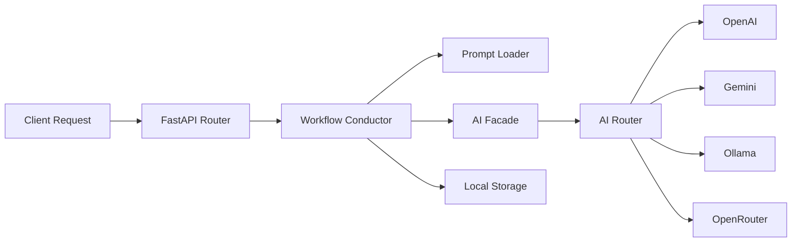

# 😎🔥 API Integration

> Operational Workflow API — modular AI orchestration backend built with FastAPI.

Project ini bukan sekadar demo FastAPI biasa 😭🔥

Repo ini dibangun sebagai:

- workflow orchestration playground
- modular AI integration foundation
- beginner-friendly backend architecture
- AI-agent collaborative codebase
- scalable experimentation environment

---

# ✨ Core Identity

```txt
workflow-first architecture
provider-agnostic AI routing
modular orchestration system
AI-agent friendly governance
```

Fokus utama project:

- memisahkan workflow dari provider
- menjaga orchestration tetap clean
- menghindari hardcoded AI logic
- memudahkan scaling bertahap
- membuat backend lebih mudah dipahami pemula

---

# 🚀 Features

## ⚡ Backend Foundation

- FastAPI modular structure
- centralized configuration system
- startup validation (fail-fast)
- centralized error handlers
- CORS middleware ready
- Swagger + ReDoc docs
- request validation via Pydantic

---

## 🤖 AI Orchestration

- multi-provider AI routing
- provider abstraction layer
- AI facade pattern
- registry-based provider system
- automatic fallback routing
- normalized AI response model
- backward compatibility gateway

Supported:

- OpenAI
- Gemini
- Ollama
- OpenRouter
- Mock Provider

---

## 🧠 Workflow System

Workflow layer bertindak sebagai:

- conductor
- orchestration coordinator
- integration boundary

Workflow bertugas:

1. load prompt
2. inject user input
3. route AI request
4. save history
5. return normalized response

---

## 📚 Governance System

Repo ini punya governance docs lengkap 😭🔥

Tujuannya:

- menjaga consistency
- membantu AI coding agent
- mengurangi architectural chaos
- mencegah layer violation
- menjaga scalability jangka panjang

Compatible untuk:

- Cline
- Roo Code
- Antigravity
- Cursor
- OpenAI Codex

---

# 🏗️ Request Journey

Request flow di project ini:



Semua orchestration dipusatkan di workflow layer 😎🔥

---

# 📁 Repository Structure

```txt
API_Integration/
├── core/
│   ├── config.py
│   ├── error_handlers.py
│   └── __init__.py
│
├── api/
│   ├── routes.py
│   └── __init__.py
│
├── workflows/
│   ├── issue_summary.py
│   └── __init__.py
│
├── services/
│   ├── ai_service.py
│   └── ai/
│       ├── facade.py
│       ├── router.py
│       ├── registry.py
│       ├── models.py
│       ├── base.py
│       └── providers/
│
├── prompts/
│   ├── loader.py
│   └── issue_summary.txt
│
├── storage/
│   ├── local_storage.py
│   └── history.json
│
├── DOCS/
│   ├── GLOBAL_DOCS/
│   ├── ORCHESTRATOR/
│   ├── RETENTION/
│   ├── INTERACTION/
│   └── HISTORY_IMPLEMENT/
│
├── analytics_projects/
├── main.py
└── README.md
```

---

# 🚀 Quick Start

## 1. Clone Repository

```bash
git clone https://github.com/sohibwong102-pixel/API_Integration.git
cd API_Integration
```

---

## 2. Create Virtual Environment

```bash
python3 -m venv .venv
source .venv/bin/activate
```

Windows:

```powershell
.venv\Scripts\activate
```

---

## 3. Install Dependencies

```bash
pip install fastapi uvicorn requests
```

---

## 4. Run Application

```bash
python main.py
```

Server:

```txt
http://127.0.0.1:8000
```

Swagger Docs:

```txt
http://127.0.0.1:8000/docs
```

ReDoc:

```txt
http://127.0.0.1:8000/redoc
```

---

# 🧪 API Example

## POST `/api/issue-summary`

```bash
curl -X POST \
  -H "Content-Type: application/json" \
  -d '{"text":"backend deploy gagal setelah update auth middleware"}' \
  http://127.0.0.1:8000/api/issue-summary
```

Response:

```json
{
  "summary": "Deployment issue related to auth middleware conflict."
}
```

---

## GET `/api/history`

```bash
curl http://127.0.0.1:8000/api/history
```

---

# 🛡️ Design Principles

## ✅ Separation of Responsibility

- API hanya handle transport
- workflow handle orchestration
- provider handle AI integration
- prompts dipisah dari business logic
- storage dipisah dari workflow

---

## ✅ Provider Agnostic

Workflow tidak tahu provider apa yang dipakai 😎🔥

Semua provider dirutekan lewat:

```txt
AI Facade → AI Router → Provider Adapter
```

Ini bikin migration & scaling jauh lebih gampang.

---

## ✅ Beginner Friendly Architecture

Codebase ini intentionally verbose 😭🔥

Banyak file berisi:

- inline explanation
- architectural comments
- request journey mapping
- orchestration notes
- layer explanation

Tujuannya supaya pemula bisa belajar backend architecture sambil baca source code langsung.

---

# 📚 Important Docs

## GLOBAL_DOCS

- `SYSTEM_ARCHITECTURE.md`
- `DEVELOPMENT_PLAYBOOK.md`
- `SYSTEM_FEATURE_MAP.md`
- `AI_PROVIDER_ROUTING_GUIDE.md`

---

## ORCHESTRATOR

- `ORCHESTRATION_BLUEPRINT.md`
- `API_USABILITY_RULES.md`

---

## RETENTION

- `API_RETENTION_RULES.md`

---

## INTERACTION

- `API_USABILITY_PRINCIPLES.md`

---

# 📉 Evolutionary Analysis

Repo ini juga punya technical analysis folder 😭🔥

```txt
analytics_projects/
```

Berisi:

- scalability analysis
- bottleneck detection
- migration planning
- future architecture evolution

---

# 📈 Evolution Path

| Current | Future Evolution |
|---|---|
| JSON Storage | PostgreSQL |
| Sync Flow | Async Queue |
| Local AI Router | Distributed Orchestrator |
| Basic Logging | Full Observability |
| Single Workflow | Multi Workflow Engine |

---

# 🎯 Built For

Cocok untuk:

- AI backend engineer
- workflow builder
- orchestration enthusiast
- automation developer
- AI coding experimenter
- backend architecture learner

---

# 📜 License

MIT License

---

# 😎 Final Words

System boleh scale 😎🔥

Team boleh gede 😎🔥

TAPI:

unsur kegoblinan tidak boleh padam 😭🔥
