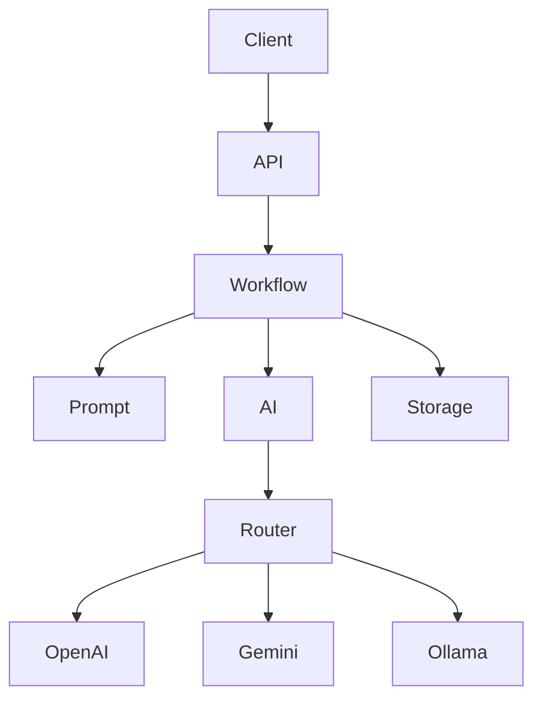

<div align="center">
# 😎🔥 CIVIL GROUP PROJECT


> Operational Workflow API — workflow-first AI orchestration backend.


</div>

Project ini dibuat untuk membangun backend AI yang:

- modular
- scalable
- provider-agnostic
- orchestration-oriented
- AI-agent friendly

---

# 🧠 Core Philosophy

Repo ini menggunakan:

```txt
Workflow Conductor Architecture
```

Artinya:

- API tidak pegang business logic
- workflow menjadi pusat orchestration
- AI provider dibuat modular
- prompt dipisah dari code
- storage dipisah dari workflow

🔥 tujuan akhirnya:

- maintainability
- scalability
- clean architecture
- beginner readability

---

# 🏗️ Request Journey



---

# 🌳 Repository Tree

```txt
API_Integration/
├── api/
│   ├── __init__.py
│   └── routes.py
│
├── core/
│   ├── __init__.py
│   ├── config.py
│   └── error_handlers.py
│
├── workflows/
│   ├── __init__.py
│   └── issue_summary.py
│
├── prompts/
│   ├── __init__.py
│   ├── loader.py
│   └── issue_summary.txt
│
├── services/
│   ├── __init__.py
│   ├── ai_service.py
│   └── ai/
│       ├── __init__.py
│       ├── base.py
│       ├── facade.py
│       ├── models.py
│       ├── registry.py
│       ├── router.py
│       └── providers/
│           ├── gemini_provider.py
│           ├── mock_provider.py
│           ├── ollama_provider.py
│           ├── openai_provider.py
│           └── openrouter_provider.py
│
├── storage/
│   ├── __init__.py
│   ├── history.json
│   └── local_storage.py
│
├── DOCS/
│   ├── GLOBAL_DOCS/
│   ├── HISTORY_IMPLEMENT/
│   ├── INTERACTION/
│   ├── ORCHESTRATOR/
│   └── RETENTION/
│
├── analytics_projects/
├── main.py
└── README.md
```

---

# 🗺️ Structure Map

## `main.py`
FastAPI application entrypoint.

Tugas:
- bootstrap app
- setup middleware
- register router
- validate config
- register error handlers

---

# ⚙️ `core/`
Centralized system foundation.

## `core/config.py`
Runtime settings manager.

## `core/error_handlers.py`
Centralized API exception handling.

## `core/__init__.py`
Official core access layer.

---

# 🌐 `api/`
HTTP transport layer.

## `api/routes.py`
FastAPI routes + Pydantic validation.

🔥 tidak boleh pegang business logic.

---

# 🧠 `workflows/`
Business orchestration layer.

## `workflows/issue_summary.py`
Workflow conductor.

Flow:

```txt
load prompt
→ call AI
→ save history
→ return response
```

---

# 📝 `prompts/`
Prompt management layer.

## `prompts/loader.py`
Prompt loader helper.

## `prompts/issue_summary.txt`
AI instruction template.

---

# 🤖 `services/`
External integration layer.

## `services/ai_service.py`
Backward compatibility gateway.

---

# 🤖 `services/ai/`
Modular AI orchestration subsystem.

## `base.py`
Provider contracts/interfaces.

## `router.py`
AI provider routing engine.

## `registry.py`
Provider registry mapping.

## `facade.py`
Unified AI access point.

## `providers/`
Provider adapters:
- OpenAI
- Gemini
- Ollama
- OpenRouter
- Mock

---

# 💾 `storage/`
Persistence layer.

## `local_storage.py`
JSON storage helper.

## `history.json`
Local request history.

---

# 📚 `DOCS/`
Governance doctrine ecosystem.

Berisi:
- architecture doctrine
- orchestration rules
- AI agent governance
- retention principles
- usability standards

---

## `GLOBAL_DOCS/`
System architecture & development doctrine.

## `ORCHESTRATOR/`
AI orchestration blueprint & role separation.

## `RETENTION/`
Developer experience & failover strategy.

## `INTERACTION/`
REST usability principles.

## `HISTORY_IMPLEMENT/`
Architecture migration history.

---

# 📉 `analytics_projects/`
Architecture bottleneck & evolution analysis.

---

# 👥 AI Agent Ecosystem

Defined AI roles:

- MANAGER_ORCHESTRATOR
- ARCHITECTURE_GUARDIAN
- BACKEND_SPECIALIST
- BACKEND_EXECUTOR
- PROMPT_SPECIALIST
- TASK_AGENT_OPTIMIZER

🔥 repo ini bukan sekadar backend.

Tapi:

```txt
AI collaborative development ecosystem
```

---

# 🚀 Quick Start

```bash
git clone https://github.com/sohibwong102-pixel/API_Integration.git
cd API_Integration

python3 -m venv .venv
source .venv/bin/activate

pip install fastapi uvicorn requests

python main.py
```

Swagger Docs:

```txt
http://127.0.0.1:8000/docs
```

---

# 😎 Final Words

```txt
system boleh scale 😎🔥
team boleh gede 😎🔥

TAPI:
unsur kegoblinan tidak boleh padam 😭🔥
```
