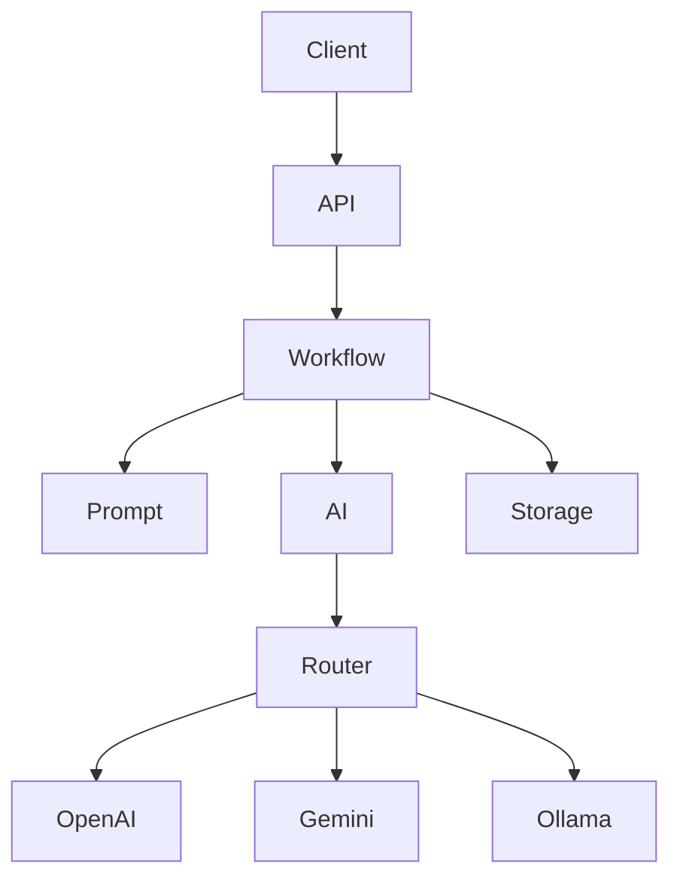

<div align="center">

<h1 align="center">😎🔥 CIVILIZATION GROUP PROJECT</h1>

> Operational Workflow API — workflow-first AI orchestration backend.


</div>

Project ini dibuat untuk membangun backend AI yang:

- modular
- scalable
- provider-agnostic
- orchestration-oriented
- AI-agent friendly
- contract-driven

---

# 🧠 Core Philosophy

Repo ini menggunakan:

```txt
Workflow Conductor Architecture
```

Artinya:

- API tidak pegang business logic
- workflow menjadi pusat orchestration
- AI provider dibuat modular
- prompt dipisah dari code
- storage dipisah dari workflow
- request lifecycle dibuat centralized

🔥 tujuan akhirnya:

- maintainability
- scalability
- clean architecture
- beginner readability
- predictable contract

---

# 🏗️ Request Journey



---

# 🌳 Repository Tree

```txt
API_Integration/
├── api/                         # HTTP transport layer
│   ├── __init__.py
│   └── routes.py                # endpoint & request validation
│
├── core/                        # centralized system foundation
│   ├── __init__.py
│   ├── config.py                # runtime settings manager
│   └── error_handlers.py        # centralized API error handling
│
├── workflows/                   # orchestration layer
│   ├── __init__.py
│   └── issue/                   # issue AI ecosystem
│       ├── __init__.py
│       ├── summary.py           # issue summarization workflow
│       ├── categorize.py        # issue categorization workflow
│       ├── severity.py          # severity classification workflow
│       ├── tags.py              # tag extraction workflow
│       └── sentiment.py         # sentiment analysis workflow
│
├── prompts/                     # prompt management layer
│   ├── __init__.py
│   ├── loader.py                # prompt loader helper
│   └── issue/                   # issue capability prompts
│       ├── summary.txt
│       ├── categorize.txt
│       ├── severity.txt
│       ├── tags.txt
│       └── sentiment.txt
│
├── services/                    # external integration layer
│   ├── __init__.py
│   ├── ai_service.py            # backward compatibility gateway
│   └── ai/                      # modular AI subsystem
│       ├── __init__.py
│       ├── base.py              # provider contracts/interfaces
│       ├── facade.py            # unified AI access layer
│       ├── models.py            # AI model definitions
│       ├── registry.py          # provider registry mapping
│       ├── router.py            # provider routing engine
│       └── providers/           # AI provider adapters
│           ├── gemini_provider.py
│           ├── mock_provider.py
│           ├── ollama_provider.py
│           ├── openai_provider.py
│           └── openrouter_provider.py
│
├── storage/                     # persistence layer
│   ├── __init__.py
│   ├── history.json             # local request history
│   └── local_storage.py         # JSON storage helper
│
├── DOCS/                        # governance & architecture docs
│   ├── GLOBAL/                  # development doctrine
│   ├── HISTORY/                 # implementation history
│   ├── INTERACTION/             # REST usability principles
│   ├── ORCHESTRATOR/            # orchestration blueprint
│   └── RETENTION/               # developer experience strategy
│
├── analytics_projects/          # architecture analysis workspace
├── main.py                      # FastAPI application entrypoint
└── README.md                    # project documentation
```

---

# 🌐 API Layer

## `api/routes.py`

FastAPI routes + request validation.

Rules:
- transport layer only
- no business logic
- workflows remain orchestration source
- request_id propagated from request lifecycle

### Active Endpoints

| Endpoint | Response |
|---|---|
| `POST /api/issue/summary` | `{ "summary": "..." }` |
| `POST /api/issue/categorize` | `{ "category": "..." }` |
| `POST /api/issue/severity` | `{ "severity": "..." }` |
| `POST /api/issue/tags` | `{ "tags": ["..."] }` |
| `POST /api/issue/sentiment` | `{ "sentiment": "..." }` |

### Legacy Compatibility

Legacy endpoint tetap tersedia:

```txt
POST /api/issue-summary
```

Response:

```json
{
  "summary": "...",
  "request_id": "..."
}
```

---

# 🔍 Request Lifecycle

Request ownership berada di boundary layer (`main.py`).

Flow:

```txt
client request
→ request_id injected/restored
→ stored in request.state
→ propagated across layers
→ exposed via X-Request-ID header
→ structured access logging
```

Structured log fields:
- request_id
- method
- path
- status_code
- duration_ms

---

# 🧠 Workflow Architecture

Workflow bersifat:

- orchestration-only
- deterministic
- reusable
- provider-agnostic
- contract-focused

Flow umum:

```txt
load prompt
→ call AI
→ normalize output
→ optional persistence
→ return response
```

Khusus workflow `summary`:
- menyimpan history request
- memakai request_id lifecycle existing

---

# 📝 Prompt System

Prompt dipisahkan per capability.

Rules:
- concise
- deterministic
- single responsibility
- no markdown output
- no JSON output

Tujuan:
- easier maintenance
- safer iteration
- isolated prompt tuning
- reusable orchestration flow

---

# 🤖 AI Provider System

Supported providers:

- OpenAI
- Gemini
- Ollama
- OpenRouter
- Mock

Architecture:

```txt
Facade
→ Router
→ Registry
→ Provider Adapter
```

Tujuan:
- provider abstraction
- fallback flexibility
- centralized orchestration
- easier future expansion

---

# 📚 DOCS/

Governance doctrine ecosystem.

Berisi:
- architecture doctrine
- orchestration standards
- AI workflow governance
- retention principles
- migration/change history
- implementation evolution

## `HISTORY/`

Implementation evolution tracking.

Digunakan untuk:
- synchronization
- migration notes
- architecture changes
- deprecated behavior cleanup
- compatibility tracking

---

# 👥 AI Agent Ecosystem

Defined AI roles:

- MANAGER_ORCHESTRATOR
- ARCHITECTURE_GUARDIAN
- BACKEND_SPECIALIST
- BACKEND_EXECUTOR
- PROMPT_SPECIALIST
- TASK_AGENT_OPTIMIZER

🔥 repo ini bukan sekadar backend.

Tapi:

```txt
AI collaborative development ecosystem
```

---

# 🚀 Quick Start

```bash
git clone https://github.com/sohibwong102-pixel/API_Integration.git
cd API_Integration

python3 -m venv .venv
source .venv/bin/activate

pip install fastapi uvicorn requests

python main.py
```

Swagger Docs:

```txt
http://127.0.0.1:8000/docs
```

---

# 😎 Final Words

```txt
system boleh scale 😎🔥
team boleh gede 😎🔥

TAPI:
unsur kegoblinan tidak boleh padam 😭🔥
```
