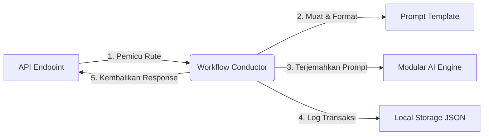

# 🛠️ Operational Workflow API (V1)

Selamat datang di proyek **Operational Workflow API (V1)**. Proyek ini dirancang sebagai kerangka kerja backend minimalis, modular, dan ramah pemula berbasis **Python** dan **FastAPI**. 

Arsitektur ini didesain agar mudah dikembangkan di masa mendatang untuk mendukung berbagai endpoint berbasis alur kerja (workflow) tanpa mengalami overengineering atau menggunakan boilerplate yang rumit.

---

## 🚀 1. Quick Start (Mulai Cepat dalam 3 Langkah)

Ikuti langkah mudah berikut di terminal Anda untuk menjalankan aplikasi secara lokal dalam hitungan menit:

### Langkah A: Inisialisasi Virtual Environment Python
Membuat dan mengaktifkan virtual environment terisolasi untuk menghindari konflik paket global:
```bash
# Membuat virtual environment bernama .venv
python3 -m venv .venv

# Mengaktifkan virtual environment (Linux/macOS)
source .venv/bin/activate

# Untuk Windows (CMD/PowerShell) gunakan:
# .venv\Scripts\activate
```

### Langkah B: Instalasi Dependensi Terkait
Pasang dependensi minimal yang dibutuhkan untuk menjalankan server API FastAPI:
```bash
pip install fastapi uvicorn requests
```
*(Catatan: Anda juga bisa menyalin berkas `.env.example` menjadi `.env` jika ingin mengonfigurasi AI provider alternatif).*

### Langkah C: Jalankan Server API
Mulai server FastAPI lokal menggunakan runner terintegrasi:
```bash
python main.py
```
*Server akan berjalan secara otomatis di alamat: **`http://127.0.0.1:8000`** dengan fitur **Auto-Reload** aktif (server akan merestart otomatis setiap kali Anda menyimpan perubahan kode).*

---

## 🧪 2. Contoh Pengujian API (API Testing Guide)

FastAPI secara otomatis menyediakan dokumentasi interaktif yang luar biasa. Anda dapat menguji API menggunakan browser melalui **Swagger UI** di alamat: **`http://127.0.0.1:8000/docs`**.

Jika Anda lebih menyukai terminal, Anda bisa membuka jendela terminal baru dan menjalankan perintah `curl` berikut:

### Skenario A: Menguji Ringkasan Isu (`POST /api/issue-summary`)
Kirimkan keluhan operasional sistem untuk diringkas oleh mesin AI:
```bash
curl -s -X POST -H "Content-Type: application/json" \
  -d '{"text": "backend deploy gagal setelah update auth middleware"}' \
  http://127.0.0.1:8000/api/issue-summary | json_pp
```
**Ekspektasi Output JSON:**
```json
{
   "summary" : "Deployment issue related to auth middleware conflict."
}
```

### Skenario B: Menguji Dynamic Mocking (Keluhan Database)
Uji dengan keluhan database untuk melihat respons asisten yang dinamis:
```bash
curl -s -X POST -H "Content-Type: application/json" \
  -d '{"text": "aplikasi mati karena database postgreSQL timeout dan gagal konek"}' \
  http://127.0.0.1:8000/api/issue-summary | json_pp
```
**Ekspektasi Output JSON:**
```json
{
   "summary" : "Database connection timeout preventing successful service startup."
}
```

### Skenario C: Meninjau Riwayat Database Lokal (`GET /api/history`)
Semua request pengujian otomatis dicatat ke dalam database JSON lokal. Tinjau semua transaksi dengan:
```bash
curl -s http://127.0.0.1:8000/api/history | json_pp
```
**Ekspektasi Output JSON:**
```json
[
   {
      "id" : 1,
      "timestamp" : "2026-05-18T18:56:24.367143",
      "original_text" : "backend deploy gagal setelah update auth middleware",
      "summary" : "Deployment issue related to auth middleware conflict."
   }
]
```

---

## 📐 3. Diagram Alur Kerja & Arsitektur (Request Journey)

Sekarang aplikasi Anda sudah berjalan dan sukses diuji! Mari kita pahami bagaimana data mengalir di dalam arsitektur aslinya:

Setiap permintaan (request) masuk dari API Client akan melewati rute modular berikut:


---

## 📁 4. Struktur Folder Proyek & Kode Sumber (Codebase Index)

Berikut adalah peta struktur direktori bersih dan terisolasi dari proyek ini untuk memandu Anda berselancar di dalam kode program:

```text
summary_endpoint/
├── .venv/                  # Virtual Environment Python
├── core/                   # ⚙️ Centralized Settings & Core System Setup
│   ├── __init__.py         # Expose settings & basis direktori absolut
│   └── config.py           # Kelas Settings (Runtime-Based Instance Config)
├── api/                    # Layer API & Request/Response Validator
│   ├── __init__.py         # Inisialisasi package & export Router
│   └── routes.py           # Endpoint FastAPI & Skema Pydantic
├── workflows/              # Layer Bisnis / Konduktor Alur Kerja
│   ├── __init__.py         # Inisialisasi package & export Workflow
│   └── issue_summary.py    # Koordinasi pemanggilan Prompt, AI, & Storage
├── services/               # Integrasi Pihak Ketiga (Modular AI Engine)
│   ├── __init__.py         # Inisialisasi package & export Gateway
│   ├── ai_service.py       # Gateway kompatibilitas ke arsitektur baru
│   └── ai/                 # 🤖 Paket Modular Multi-Provider AI (Refactored)
│       ├── __init__.py      # Expose facade, router, & registry
│       ├── base.py          # Interface/contract BaseAIService & BaseProvider
│       ├── facade.py        # Unified entry point (AIFacade) untuk workflow
│       ├── models.py        # Normalized response format (AIResponse)
│       ├── registry.py      # Registri pemetaan provider adapter
│       ├── router.py        # Logika perutean & orkestrasi fallback
│       └── providers/       # Adapter Penyedia Layanan AI
│           ├── __init__.py  # Expose adapter
│           ├── mock_provider.py
│           ├── ollama_provider.py
│           ├── openai_provider.py
│           ├── gemini_provider.py
│           └── openrouter_provider.py
├── prompts/                # Koleksi Prompt Engineering
│   ├── __init__.py         # Inisialisasi package & export Loader
│   ├── loader.py           # Helper pemuat & pemformat file prompt .txt
│   └── issue_summary.txt   # File teks template instruksi AI
├── storage/                # Layer Penyimpanan Data (File-Based JSON)
│   ├── __init__.py         # Inisialisasi package & export Storage
│   ├── history.json        # Database log lokal berbasis file JSON
│   └── local_storage.py    # Helper I/O baca-tulis file JSON
├── DOCS/                   # 📂 Dokumen Tata Kelola & Riwayat Proyek
│   ├── GLOBAL_DOCS/        # 📚 Doktrin Global & Playbook Keselamatan API
│   ├── ORCHESTRATOR/       # ⚙️ Panduan Orkestrasi AI Pengembang
│   ├── RETENTION/          # 🎯 Panduan Retensi Integrasi & Ketahanan API
│   ├── INTERACTION/        # ⚡ Standar Desain Skema & Ketergunaan REST API
│   └── HISTORY_IMPLEMENT/  # 📝 Catatan Perubahan & Fitur Terimplementasi
├── analytics_projects/     # 📉 Laporan Audit Arsitektur & Hutang Teknis
├── main.py                 # Entry point aplikasi utama (Inisialisasi FastAPI)
└── README.md               # Dokumentasi panduan lengkap (File Ini)
```

---

## 📄 5. Penjelasan Setiap Berkas (File Explanation)

### ⚙️ [core/](file:///home/shobixlinuxdev/DEV_GLOBAL/Projects/summary_endpoint/core/) & [core/config.py](file:///home/shobixlinuxdev/DEV_GLOBAL/Projects/summary_endpoint/core/config.py)
* **Peran:** Pusat Pengaturan & Konfigurasi Sistem Terpusat.
* **Fungsi:** Mengadopsi arsitektur **Runtime-Based Instance Configuration**:
  - **`config.py`**: Kelas `Settings` dinamis yang memuat variabel lingkungan dari berkas `.env` saat objek dibuat dan mengonversi properti (Host, Port, AI Provider, API Keys, DB Path) menjadi instance variables dengan dukungan *strict fail-fast validation* pada startup server.
  - **`__init__.py`**: Mengekspos instansi tunggal (*singleton*) `settings` secara global untuk menjamin konsistensi pembacaan data di seluruh layer aplikasi.

### 1. [main.py](file:///home/shobixlinuxdev/DEV_GLOBAL/Projects/summary_endpoint/main.py)
* **Peran:** Titik masuk utama server.
* **Fungsi:** Menginisialisasi aplikasi FastAPI, mengonfigurasi middleware CORS, memasang APIRouter modular dari folder `/api` dengan prefix `/api`, serta menyediakan rute root `/` untuk pengecekan status server.

### 2. [api/routes.py](file:///home/shobixlinuxdev/DEV_GLOBAL/Projects/summary_endpoint/api/routes.py)
* **Peran:** Gerbang masuk HTTP Request & Validasi Pydantic.
* **Fungsi:** Menampung skema data Pydantic (`IssueRequest`, `IssueResponse`) untuk validasi tipe data payload JSON secara otomatis. Mengarahkan request `POST /api/issue-summary` langsung ke workflow penanganannya.

### 3. [workflows/issue_summary.py](file:///home/shobixlinuxdev/DEV_GLOBAL/Projects/summary_endpoint/workflows/issue_summary.py)
* **Peran:** Otak bisnis aplikasi (Workflow Coordinator).
* **Fungsi:** Mengatur orkestrasi pemrosesan laporan masalah tanpa mengetahui detail teknis dari masing-masing komponen. Tugasnya:
  1. Memuat file template prompt dari `/prompts`.
  2. Menyisipkan input teks dari API ke template prompt.
  3. Memanggil AI Service agnostik.
  4. Menyimpan catatan transaksi di local storage.
  5. Mengembalikan hasil ke API.

### 4. [services/ai/](file:///home/shobixlinuxdev/DEV_GLOBAL/Projects/summary_endpoint/services/ai/) & [services/ai_service.py](file:///home/shobixlinuxdev/DEV_GLOBAL/Projects/summary_endpoint/services/ai_service.py)
* **Peran:** Paket Mesin Multi-Provider AI Modular & Gateway Kompatibilitas.
* **Fungsi:** Paket modular ini mengadopsi **Facade, Router, dan Registry Patterns** untuk perutean AI dinamis berbasis konfigurasi:
  - **`services/ai/base.py`**: Kontrak antarmuka (`BaseAIService`, `BaseProvider`) untuk isolasi dependensi longgar.
  - **`services/ai/models.py`**: Standardisasi format respon terpadu (`AIResponse`) agar seragam.
  - **`services/ai/registry.py`**: Registri pemetaan string nama provider ke class adapter penyedia AI.
  - **`services/ai/router.py`**: Logika `AIRouter` yang membaca prioritas `PRIMARY_PROVIDER` / `FALLBACK_PROVIDER` dari env dan melakukan *auto-failover* otomatis jika provider utama mengalami kegagalan.
  - **`services/ai/facade.py`**: Menyediakan entry point tunggal `AIFacade` bagi layer bisnis agar tetap steril.
  - **`services/ai/providers/`**: Adapter modular terisolasi untuk penyedia AI (Ollama Lokal, Google Gemini, OpenAI, OpenRouter, dan Mock).
  - **`services/ai_service.py`**: Berkas gateway kompatibilitas ke belakang (*backward compatibility*) yang mengarahkan pemanggilan legacy `get_ai_service()` langsung ke `AIFacade()` yang baru sehingga nol perubahan terjadi pada layer bisnis.

### 5. [prompts/loader.py](file:///home/shobixlinuxdev/DEV_GLOBAL/Projects/summary_endpoint/prompts/loader.py)
* **Peran:** Pemisah instruksi AI dengan instruksi pemrograman.
* **Fungsi:** Berisi helper untuk membaca berkas `.txt` secara aman dari disk dan menyediakan fungsi format Python dinamis demi mencegah penulisan prompt secara hardcode di baris kode aplikasi.

### 6. [storage/local_storage.py](file:///home/shobixlinuxdev/DEV_GLOBAL/Projects/summary_endpoint/storage/local_storage.py)
* **Peran:** Persistence Layer minimalis.
* **Fungsi:** Mengelola baca-tulis riwayat request secara langsung ke file `storage/history.json`.

---

## 📈 6. Keunggulan Desain Modular Ini

1. **Sangat Mudah Dikembangkan:** Jika ingin menambahkan alur kerja baru (misalnya `/issue-categorize` atau `/generate-playbook`), Anda hanya perlu membuat workflow baru di `/workflows`, membuat prompt di `/prompts`, dan mendaftarkan rutenya di `/api/routes.py`.
2. **AI Provider Routing & Fallback Cerdas**: Didukung penuh oleh arsitektur `services/ai/` yang modular. Berganti provider utama (`PRIMARY_PROVIDER`) atau menentukan cadangan (`FALLBACK_PROVIDER`) kini 100% berbasis konfigurasi *environment variables*, lengkap dengan *auto-failover* instan jika server utama bermasalah.
3. **Penyimpanan Terisolasi:** Modul penyimpanan terisolasi di `/storage` sehingga jika Anda ingin naik kelas menggunakan SQLite/PostgreSQL, Anda tinggal mendefinisikan kodenya di `storage/` tanpa menyentuh core workflow atau api router.

---

## 🤖 7. Protokol Kontribusi Agen AI (AI Coding Agent Protocol)

Jika Anda adalah **Agen AI Coding (seperti Antigravity, Cline, Roo Code, dll.)** yang dipanggil untuk berkontribusi atau memodifikasi repositori ini, Anda **WAJIB** membaca dan mematuhi aturan tata kelola di bawah ini sebelum memodifikasi berkas apa pun:

### 🛡️ Matriks Keselamatan File (File Safety Matrix)
* Buka dan pelajari [DEVELOPMENT_PLAYBOOK.md](file:///home/shobixlinuxdev/DEV_GLOBAL/Projects/summary_endpoint/DOCS/GLOBAL_DOCS/DEVELOPMENT_PLAYBOOK.md) untuk melihat pembagian keamanan berkas (**Red, Yellow, Green Tiers**).
* **Dilarang keras** memodifikasi file berlabel **RED TIER** tanpa persetujuan manual eksplisit dari pengguna.

### ⚙️ Hubungkan Peran AI Anda (AI Agent Alignment)
* Buka [ORCHESTRATION_BLUEPRINT.md](file:///home/shobixlinuxdev/DEV_GLOBAL/Projects/summary_endpoint/DOCS/ORCHESTRATOR/ORCHESTRATION_BLUEPRINT.md) untuk menyelaraskan peran Anda.
* Pastikan apakah tugas Anda termasuk dalam domain **Thinker/Specialist** (desain arsitektur) atau **Executor/Implementation** (penulisan kode program).

### 📐 Batasan Layer Direktori (Encapsulation Boundaries)
* Jangan memintas alur workflow! Dilarang memanggil database JSON atau AI Service secara langsung di dalam [api/routes.py](file:///home/shobixlinuxdev/DEV_GLOBAL/Projects/summary_endpoint/api/routes.py).
* Semua logika orkestrasi wajib diselesaikan di layer konduktor [workflows/](file:///home/shobixlinuxdev/DEV_GLOBAL/Projects/summary_endpoint/workflows/) sesuai blueprint di [SYSTEM_ARCHITECTURE.md](file:///home/shobixlinuxdev/DEV_GLOBAL/Projects/summary_endpoint/DOCS/GLOBAL_DOCS/SYSTEM_ARCHITECTURE.md).

### ⚡ Desain DX & Penanganan Error
* Semua rute API dan response error wajib memenuhi kriteria ketergunaan pengembang (DX) di [API_USABILITY_RULES.md](file:///home/shobixlinuxdev/DEV_GLOBAL/Projects/summary_endpoint/DOCS/ORCHESTRATOR/API_USABILITY_RULES.md) dan [API_USABILITY_PRINCIPLES.md](file:///home/shobixlinuxdev/DEV_GLOBAL/Projects/summary_endpoint/DOCS/INTERACTION/API_USABILITY_PRINCIPLES.md).
* Gunakan Pydantic untuk validasi tipe data dan bungkus exception dengan `HTTPException` terformat.

### 📈 Peta Jalan & Hambatan Evolusi (Evolutionary Analysis)
* Sebelum melakukan refactoring database atau koneksi HTTP, Anda **wajib** mempelajari analisis teknis di [evolutionary_bottlenecks.md](file:///home/shobixlinuxdev/DEV_GLOBAL/Projects/summary_endpoint/analytics_projects/evolutionary_bottlenecks.md) untuk memahami tantangan file-locking, thread starvation, dan auto-failover LLM.

---

## 📚 8. Sistem Doktrin & Kebijakan Repositori (Repository Doctrines)

Proyek ini dilengkapi dengan modul tata kelola doktrin dan pedoman pengembangan terpadu untuk memastikan kepatuhan standar kualitas tinggi bagi pengembang manusia maupun Agen AI Coding:

### 📚 Doktrin Global & Playbook API (`DOCS/GLOBAL_DOCS/`)
Dokumen tata kelola arsitektur, standar keselamatan, dan peta fitur sistem:
* 📄 **[SYSTEM_ARCHITECTURE.md](file:///home/shobixlinuxdev/DEV_GLOBAL/Projects/summary_endpoint/DOCS/GLOBAL_DOCS/SYSTEM_ARCHITECTURE.md)**: Detail pembagian arsitektur modular, batasan layer direktori, dan diagram request-response.
* 📄 **[DEVELOPMENT_PLAYBOOK.md](file:///home/shobixlinuxdev/DEV_GLOBAL/Projects/summary_endpoint/DOCS/GLOBAL_DOCS/DEVELOPMENT_PLAYBOOK.md)**: Aturan Matriks Keselamatan File (**Red, Yellow, Green**) dan larangan modifikasi kode.
* 📄 **[SYSTEM_FEATURE_MAP.md](file:///home/shobixlinuxdev/DEV_GLOBAL/Projects/summary_endpoint/DOCS/GLOBAL_DOCS/SYSTEM_FEATURE_MAP.md)**: Indeks rute aktif dan peta jalan evolusi/skalabilitas sistem.
* 📄 **[AI_PROVIDER_ROUTING_GUIDE.md](file:///home/shobixlinuxdev/DEV_GLOBAL/Projects/summary_endpoint/DOCS/GLOBAL_DOCS/AI_PROVIDER_ROUTING_GUIDE.md)**: Panduan perutean penyedia AI (Lokal, Cloud, Pihak Ketiga) dan strategi Auto-Failover LLM bagi pemula.

---

### ⚙️ Pedoman Orkestrasi AI (`DOCS/ORCHESTRATOR/`)
Dokumen khusus yang mengatur alur orkestrasi pengerjaan AI:
* 📄 **[ORCHESTRATION_BLUEPRINT.md](file:///home/shobixlinuxdev/DEV_GLOBAL/Projects/summary_endpoint/DOCS/ORCHESTRATOR/ORCHESTRATION_BLUEPRINT.md)**: Peran 6 AI Agent pembangun dan perutean tugas Backend (Thinker vs. Executor).
* 📄 **[API_USABILITY_RULES.md](file:///home/shobixlinuxdev/DEV_GLOBAL/Projects/summary_endpoint/DOCS/ORCHESTRATOR/API_USABILITY_RULES.md)**: Pedoman Developer Experience (DX) untuk standardisasi format JSON dan dokumentasi Swagger UI.

---

### 🎯 Pedoman Retensi Integrasi (`DOCS/RETENTION/`)
Aturan khusus untuk mengoptimalkan pengalaman pengembang dan reduksi friksi:
* 📄 **[API_RETENTION_RULES.md](file:///home/shobixlinuxdev/DEV_GLOBAL/Projects/summary_endpoint/DOCS/RETENTION/API_RETENTION_RULES.md)**: Sinyal kelelahan integrasi developer (422 error, latency tinggi) dan otomatisasi *failover* LLM.

---

### ⚡ Pedoman Ketergunaan REST (`DOCS/INTERACTION/`)
Prinsip desain antarmuka REST API dan optimalisasi payload:
* 📄 **[API_USABILITY_PRINCIPLES.md](file:///home/shobixlinuxdev/DEV_GLOBAL/Projects/summary_endpoint/DOCS/INTERACTION/API_USABILITY_PRINCIPLES.md)**: Aturan kebab-case rute URL, semantik penamaan kunci JSON, serta anggaran latensi (latency budgets).

---

## 📉 9. Analisis Arsitektur & Hambatan Evolusi (Evolutionary Analysis)

Untuk memastikan proyek ini dapat dikembangkan dalam skala besar tanpa hambatan performa, kami melakukan audit teknis mendalam terhadap kode saat ini:

* 📂 **[analytics_projects/](file:///home/shobixlinuxdev/DEV_GLOBAL/Projects/summary_endpoint/analytics_projects/)**
  * 📄 **[evolutionary_bottlenecks.md](file:///home/shobixlinuxdev/DEV_GLOBAL/Projects/summary_endpoint/analytics_projects/evolutionary_bottlenecks.md)**: Detail analisis teknis terkait hambatan file-locking, thread starvation sinkronus, dan peta jalan migrasi asinkronus SQLite/SQLAlchemy.

---

## 📝 10. Riwayat Migrasi & Fitur Terimplementasi (Implementation History)

Pelacakan log perubahan besar dan migrasi arsitektur pada repositori:

* 📂 **[HISTORY_IMPLEMENT/](file:///home/shobixlinuxdev/DEV_GLOBAL/Projects/summary_endpoint/DOCS/HISTORY_IMPLEMENT/)**
  * 📄 **[2026_05_18_backend_architecture_refactoring.md](file:///home/shobixlinuxdev/DEV_GLOBAL/Projects/summary_endpoint/DOCS/HISTORY_IMPLEMENT/2026_05_18_backend_architecture_refactoring.md)**: Konsolidasi arsitektur konfigurasi dinamis (*runtime-based instance config*) dan perutean AI multi-provider dengan fitur *auto-failover*.
  * 📄 **[2026_05_19_unified_base_dir_entrypoint.md](file:///home/shobixlinuxdev/DEV_GLOBAL/Projects/summary_endpoint/DOCS/HISTORY_IMPLEMENT/2026_05_19_unified_base_dir_entrypoint.md)**: Standardisasi pola impor variabel `BASE_DIR` agar terpusat melalui satu modul pintu masuk (`core`) untuk menghindari circular dependency.
  * 📄 **[2026_05_19_api_request_validation_hardening.md](file:///home/shobixlinuxdev/DEV_GLOBAL/Projects/summary_endpoint/DOCS/HISTORY_IMPLEMENT/2026_05_19_api_request_validation_hardening.md)**: Pengerasan (*hardening*) validasi data masukan API menggunakan Pydantic (pembersihan spasi, pencegahan teks kosong, dan batas maksimal karakter).
