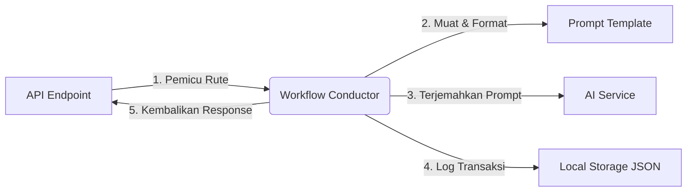

# 🛠️ Operational Workflow API (V1)

Selamat datang di proyek **Operational Workflow API (V1)**. Proyek ini dirancang sebagai kerangka kerja backend minimalis, modular, dan ramah pemula berbasis **Python** dan **FastAPI**. 

Arsitektur ini didesain agar mudah dikembangkan di masa mendatang untuk mendukung berbagai endpoint berbasis alur kerja (workflow) tanpa mengalami overengineering atau menggunakan boilerplate yang rumit.

---

## 📐 Arsitektur & Jalur Kerja (Workflow Path)
Setiap permintaan (request) masuk akan melewati rute modular berikut:


---

## 📁 Struktur Folder Proyek (Target Structure)

Berikut adalah struktur direktori yang bersih dan terisolasi dari proyek ini:

```text
summary_endpoint/
├── .venv/                  # Virtual Environment Python
├── api/                    # Layer API & Request/Response Validator
│   ├── __init__.py         # Inisialisasi package & export Router
│   └── routes.py           # Endpoint FastAPI & Skema Pydantic
├── workflows/              # Layer Bisnis / Konduktor Alur Kerja
│   ├── __init__.py         # Inisialisasi package & export Workflow
│   └── issue_summary.py    # Koordinasi pemanggilan Prompt, AI, & Storage
├── services/               # Integrasi Pihak Ketiga (AI Engine)
│   ├── __init__.py         # Inisialisasi package & export AI Service
│   └── ai_service.py       # Interface BaseAIService & implementasi Mock/Qwen AI
├── prompts/                # Koleksi Prompt Engineering
│   ├── __init__.py         # Inisialisasi package & export Loader
│   ├── loader.py           # Helper pemuat & pemformat file prompt .txt
│   └── issue_summary.txt   # File teks template instruksi AI
├── storage/                # Layer Penyimpanan Data (File-Based JSON)
│   ├── __init__.py         # Inisialisasi package & export Storage
│   ├── history.json        # Database log lokal berbasis file JSON
│   └── local_storage.py    # Helper I/O baca-tulis file JSON
├── GLOBAL_DOCS/            # 📚 Doktrin Global & Playbook Keselamatan API
│   ├── SYSTEM_ARCHITECTURE.md  # Detail Arsitektur & Mermaid Request Flow
│   ├── DEVELOPMENT_PLAYBOOK.md # Matriks Keselamatan File (Red/Yellow/Green)
│   └── SYSTEM_FEATURE_MAP.md   # Pemetaan Fitur & Rencana Pengembangan Masa Depan
├── ORCHESTRATOR/           # ⚙️ Panduan Orkestrasi AI Pengembang
│   ├── ORCHESTRATION_BLUEPRINT.md # Pembagian Peran AI Agent (Thinker vs Executor)
│   └── API_USABILITY_RULES.md     # Standar Developer Experience (DX) & Respon
├── RETENTION/              # 🎯 Panduan Retensi Integrasi & Ketahanan API
│   └── API_RETENTION_RULES.md     # Pengurangan Friction Integrasi & Auto-Failover LLM
├── INTERACTION/            # ⚡ Standar Desain Skema & Ketergunaan REST API
│   └── API_USABILITY_PRINCIPLES.md # Penamaan Semantik Kunci JSON & Latency Budgets
├── analytics_projects/     # 📉 Laporan Audit Arsitektur & Hutang Teknis
│   └── evolutionary_bottlenecks.md # Detail hambatan I/O JSON, blocking client, & peta jalan
├── main.py                 # Entry point aplikasi utama (Inisialisasi FastAPI)
└── README.md               # Dokumentasi panduan lengkap (File Ini)
```

---

## 📄 Penjelasan Setiap Berkas (File Explanation)

### 1. [main.py](file:///home/shobixlinuxdev/DEV_GLOBAL/Projects/summary_endpoint/main.py)
* **Peran:** Titik masuk utama server.
* **Fungsi:** Menginisialisasi aplikasi FastAPI, mengonfigurasi middleware CORS, memasang APIRouter modular dari folder `/api` dengan prefix `/api`, serta menyediakan rute root `/` untuk pengecekan status server. Dilengkapi runner otomatis `uvicorn` saat dijalankan via `python main.py`.

### 2. [api/routes.py](file:///home/shobixlinuxdev/DEV_GLOBAL/Projects/summary_endpoint/api/routes.py)
* **Peran:** Gerbang masuk HTTP Request.
* **Fungsi:** Menampung skema data Pydantic (`IssueRequest`, `IssueResponse`) untuk validasi tipe data payload JSON secara otomatis. Mengarahkan request `POST /api/issue-summary` langsung ke workflow penanganannya. Kami juga menambahkan `GET /api/history` untuk kemudahan meninjau database lokal.

### 3. [workflows/issue_summary.py](file:///home/shobixlinuxdev/DEV_GLOBAL/Projects/summary_endpoint/workflows/issue_summary.py)
* **Peran:** Otak bisnis aplikasi (Workflow Coordinator).
* **Fungsi:** Mengatur orkestrasi pemrosesan laporan masalah tanpa mengetahui detail teknis dari masing-masing komponen. Tugasnya:
  1. Memuat file template prompt dari `/prompts`.
  2. Menyisipkan input teks dari API ke template prompt.
  3. Memanggil AI Service agnostik.
  4. Menyimpan catatan transaksi di local storage.
  5. Mengembalikan hasil ke API.

### 4. [services/ai_service.py](file:///home/shobixlinuxdev/DEV_GLOBAL/Projects/summary_endpoint/services/ai_service.py)
* **Peran:** Penghubung kecerdasan buatan (AI Gateway).
* **Fungsi:** Menyediakan interface `BaseAIService` agar workflow bersifat longgar (*loose coupling*). Menyediakan `MockAIService` cerdas berbasis keyword matching dinamis untuk pengembangan awal. Memuat blueprint code siap pakai untuk beralih ke **Google Gemini** atau **OpenAI** cukup dengan mengubah fungsi factory `get_ai_service()`.

### 5. [prompts/loader.py](file:///home/shobixlinuxdev/DEV_GLOBAL/Projects/summary_endpoint/prompts/loader.py)
* **Peran:** Pemisah instruksi AI dengan instruksi pemrograman.
* **Fungsi:** Berisi helper untuk membaca berkas `.txt` secara aman dari disk dan menyediakan fungsi format Python dinamis demi mencegah penulisan prompt secara hardcode di baris kode aplikasi.

### 6. [storage/local_storage.py](file:///home/shobixlinuxdev/DEV_GLOBAL/Projects/summary_endpoint/storage/local_storage.py)
* **Peran:** Persistence Layer minimalis.
* **Fungsi:** Mengelola baca-tulis riwayat request secara langsung ke file `storage/history.json`. Berguna untuk melacak log pemrosesan isu sistem tanpa membutuhkan database relasional yang rumit seperti PostgreSQL atau SQLite.

---

## 🤖 PENTING: Protokol Kontribusi Agen AI (AI Coding Agent Protocol)

Jika Anda adalah **Agen AI Coding (seperti Antigravity, Cline, Roo Code, dll.)** yang dipanggil untuk berkontribusi atau memodifikasi repositori ini, Anda **WAJIB** membaca dan mematuhi aturan tata kelola di bawah ini sebelum memodifikasi berkas apa pun:

### 🛡️ 1. Patuhi Matriks Keselamatan File (File Safety Matrix)
* Buka dan pelajari [DEVELOPMENT_PLAYBOOK.md](file:///home/shobixlinuxdev/DEV_GLOBAL/Projects/summary_endpoint/GLOBAL_DOCS/DEVELOPMENT_PLAYBOOK.md) untuk melihat pembagian keamanan berkas (**Red, Yellow, Green Tiers**).
* **Dilarang keras** memodifikasi file berlabel **RED TIER** tanpa persetujuan manual eksplisit dari pengguna.

### ⚙️ 2. Hubungkan Peran AI Anda (AI Agent Alignment)
* Buka [ORCHESTRATION_BLUEPRINT.md](file:///home/shobixlinuxdev/DEV_GLOBAL/Projects/summary_endpoint/ORCHESTRATOR/ORCHESTRATION_BLUEPRINT.md) untuk menyelaraskan peran Anda.
* Pastikan apakah tugas Anda termasuk dalam domain **Thinker/Specialist** (desain arsitektur) atau **Executor/Implementation** (penulisan kode program).

### 📐 3. Batasan Layer Direktori (Encapsulation Boundaries)
* Jangan memintas alur workflow! Dilarang memanggil database JSON atau AI Service secara langsung di dalam [api/routes.py](file:///home/shobixlinuxdev/DEV_GLOBAL/Projects/summary_endpoint/api/routes.py).
* Semua logika orkestrasi wajib diselesaikan di layer konduktor [workflows/](file:///home/shobixlinuxdev/DEV_GLOBAL/Projects/summary_endpoint/workflows/) sesuai blueprint di [SYSTEM_ARCHITECTURE.md](file:///home/shobixlinuxdev/DEV_GLOBAL/Projects/summary_endpoint/GLOBAL_DOCS/SYSTEM_ARCHITECTURE.md).

### ⚡ 4. Desain DX & Penanganan Error
* Semua rute API dan response error wajib memenuhi kriteria ketergunaan pengembang (DX) di [API_USABILITY_RULES.md](file:///home/shobixlinuxdev/DEV_GLOBAL/Projects/summary_endpoint/ORCHESTRATOR/API_USABILITY_RULES.md) dan [API_USABILITY_PRINCIPLES.md](file:///home/shobixlinuxdev/DEV_GLOBAL/Projects/summary_endpoint/INTERACTION/API_USABILITY_PRINCIPLES.md).
* Gunakan Pydantic untuk validasi tipe data dan bungkus exception dengan `HTTPException` terformat.

### 📈 5. Peta Jalan & Hambatan Evolusi (Evolutionary Analysis)
* Sebelum melakukan refactoring database atau koneksi HTTP, Anda **wajib** mempelajari analisis teknis di [evolutionary_bottlenecks.md](file:///home/shobixlinuxdev/DEV_GLOBAL/Projects/summary_endpoint/analytics_projects/evolutionary_bottlenecks.md) untuk memahami tantangan file-locking, thread starvation, dan auto-failover LLM.

---

## ⚡ Perintah Menjalankan Proyek (Command Run Project)

Ikuti langkah mudah berikut di terminal Anda untuk menjalankan aplikasi secara lokal:

### 1. Inisialisasi Lingkungan Virtual (Virtual Environment)
```bash
# Membuat virtual environment bernama .venv
python3 -m venv .venv

# Mengaktifkan virtual environment
source .venv/bin/activate
```

### 2. Instalasi Dependensi (FastAPI & Uvicorn)
```bash
pip install fastapi uvicorn
```

### 3. Menjalankan Server API
Cukup jalankan entry point secara langsung menggunakan Python:
```bash
python main.py
```
*Server akan berjalan secara otomatis di alamat: **`http://127.0.0.1:8000`** dengan fitur **Auto-Reload** aktif (server akan merestart otomatis setiap kali Anda menyimpan perubahan kode).*

---

## 🧪 Contoh Pengujian API (Simple Request Example)

Anda dapat menguji API menggunakan terminal (`curl`) atau melalui **Swagger UI** interaktif bawaan FastAPI di browser dengan membuka: **`http://127.0.0.1:8000/docs`**.

### 1. Menguji Ringkasan Isu (`POST /api/issue-summary`)

Jalankan perintah `curl` berikut di jendela terminal baru untuk meringkas keluhan operasional:

```bash
curl -s -X POST -H "Content-Type: application/json" \
  -d '{"text": "backend deploy gagal setelah update auth middleware"}' \
  http://127.0.0.1:8000/api/issue-summary | json_pp
```

**Ekspektasi Output JSON:**
```json
{
   "summary" : "Deployment issue related to auth middleware conflict."
}
```

---

### 2. Menguji Dynamic Mocking Lainnya (`POST /api/issue-summary` - Database)

Uji dengan topik database untuk melihat kecerdasan logis `MockAIService` merespons secara dinamis:

```bash
curl -s -X POST -H "Content-Type: application/json" \
  -d '{"text": "aplikasi mati karena database postgreSQL timeout dan gagal konek"}' \
  http://127.0.0.1:8000/api/issue-summary | json_pp
```

**Ekspektasi Output JSON:**
```json
{
   "summary" : "Database connection timeout preventing successful service startup."
}
```

---

### 3. Memeriksa Riwayat Penyimpanan (`GET /api/history`)

Setiap pengujian di atas otomatis tercatat ke dalam local database JSON kita. Anda bisa mengecek seluruh log dengan:

```bash
curl -s http://127.0.0.1:8000/api/history | json_pp
```

**Ekspektasi Output JSON:**
```json
[
   {
      "id" : 1,
      "timestamp" : "2026-05-17T18:56:24.367143",
      "original_text" : "backend deploy gagal setelah update auth middleware",
      "summary" : "Deployment issue related to auth middleware conflict."
   },
   {
      "id" : 2,
      "timestamp" : "2026-05-17T18:56:35.023320",
      "original_text" : "aplikasi mati karena database postgreSQL timeout dan gagal konek",
      "summary" : "Database connection timeout preventing successful service startup."
   }
]
```

---

## 📈 Keunggulan Desain Modular Ini
1. **Sangat Mudah Dikembangkan:** Jika ingin menambahkan alur kerja baru (misalnya `/issue-categorize` atau `/generate-playbook`), Anda hanya perlu membuat workflow baru di `/workflows`, membuat prompt di `/prompts`, dan mendaftarkan rutenya di `/api/routes.py`.
2. **AI Provider Agnostik:** Anda bebas bertransisi dari mock, OpenAI, hingga Google Gemini kapan saja hanya dengan mengubah *factory* `services/ai_service.py` tanpa mengganggu lapisan bisnis lainnya.
3. **Penyimpanan Terisolasi:** Modul penyimpanan terisolasi di `/storage` sehingga jika Anda ingin naik kelas menggunakan SQLite/PostgreSQL, Anda tinggal mendefinisikan kodenya di `storage/` tanpa menyentuh core workflow atau api router.

---

## 📚 Sistem Doktrin & Kebijakan Repositori (Repository Doctrines)

Proyek ini dilengkapi dengan modul tata kelola doktrin dan pedoman pengembangan terpadu untuk memastikan kepatuhan standar kualitas tinggi bagi pengembang manusia maupun Agen AI Coding:

### 📚 1. Doktrin Global & Playbook API (`GLOBAL_DOCS/`)
Dokumen tata kelola arsitektur, standar keselamatan, dan peta fitur sistem:
* 📄 **[SYSTEM_ARCHITECTURE.md](file:///home/shobixlinuxdev/DEV_GLOBAL/Projects/summary_endpoint/GLOBAL_DOCS/SYSTEM_ARCHITECTURE.md)**: Detail pembagian arsitektur modular, batasan layer direktori, dan diagram request-response.
* 📄 **[DEVELOPMENT_PLAYBOOK.md](file:///home/shobixlinuxdev/DEV_GLOBAL/Projects/summary_endpoint/GLOBAL_DOCS/DEVELOPMENT_PLAYBOOK.md)**: Matriks Keselamatan File (**Red, Yellow, Green**) dan larangan modifikasi kode.
* 📄 **[SYSTEM_FEATURE_MAP.md](file:///home/shobixlinuxdev/DEV_GLOBAL/Projects/summary_endpoint/GLOBAL_DOCS/SYSTEM_FEATURE_MAP.md)**: Indeks rute aktif dan peta jalan evolusi/skalabilitas sistem.
* 📄 **[AI_PROVIDER_ROUTING_GUIDE.md](file:///home/shobixlinuxdev/DEV_GLOBAL/Projects/summary_endpoint/GLOBAL_DOCS/AI_PROVIDER_ROUTING_GUIDE.md)**: Panduan perutean penyedia AI (Lokal, Cloud, Pihak Ketiga) dan strategi Auto-Failover LLM bagi pemula.

---

### ⚙️ 2. Pedoman Orkestrasi AI (`ORCHESTRATOR/`)
Dokumen khusus yang mengatur alur orkestrasi pengerjaan AI:
* 📄 **[ORCHESTRATION_BLUEPRINT.md](file:///home/shobixlinuxdev/DEV_GLOBAL/Projects/summary_endpoint/ORCHESTRATOR/ORCHESTRATION_BLUEPRINT.md)**: Peran 6 AI Agent pembangun dan perutean tugas Backend (Thinker vs. Executor).
* 📄 **[API_USABILITY_RULES.md](file:///home/shobixlinuxdev/DEV_GLOBAL/Projects/summary_endpoint/ORCHESTRATOR/API_USABILITY_RULES.md)**: Pedoman Developer Experience (DX) untuk standardisasi format JSON dan dokumentasi Swagger UI.

---

### 🎯 3. Pedoman Retensi Integrasi (`RETENTION/`)
Aturan khusus untuk mengoptimalkan pengalaman pengembang dan reduksi friksi:
* 📄 **[API_RETENTION_RULES.md](file:///home/shobixlinuxdev/DEV_GLOBAL/Projects/summary_endpoint/RETENTION/API_RETENTION_RULES.md)**: Sinyal kelelahan integrasi developer (422 error, latency tinggi) dan otomatisasi *failover* LLM.

---

### ⚡ 4. Pedoman Ketergunaan REST (`INTERACTION/`)
Prinsip desain antarmuka REST API dan optimalisasi payload:
* 📄 **[API_USABILITY_PRINCIPLES.md](file:///home/shobixlinuxdev/DEV_GLOBAL/Projects/summary_endpoint/INTERACTION/API_USABILITY_PRINCIPLES.md)**: Aturan kebab-case rute URL, semantik penamaan kunci JSON, serta anggaran latensi (latency budgets).


---

## 📉 Analisis Arsitektur & Hambatan Evolusi (Evolutionary Analysis)

Untuk memastikan proyek ini dapat dikembangkan dalam skala besar tanpa hambatan performa, kami melakukan audit teknis mendalam terhadap kode saat ini:

* **[analytics_projects/evolutionary_bottlenecks.md](file:///home/shobixlinuxdev/DEV_GLOBAL/Projects/summary_endpoint/analytics_projects/evolutionary_bottlenecks.md)**:
  * **Hambatan I/O Disk Tunggal**: Analisis potensi starvation memori dan balapan data (*race condition*) akibat penyimpanan `history.json`.
  * **Hambatan Client Jaringan Blocking**: Potensi bottleneck pemanggilan AI sinkronus menggunakan library `requests`.
  * **Evolutionary Roadmap**: Rencana mitigasi migrasi database relasional (SQLite/PostgreSQL SQLAlchemy), transisi stack asinkronus (`httpx async` & `async def` routing), serta implementasi failover sirkuit AI cadangan.

