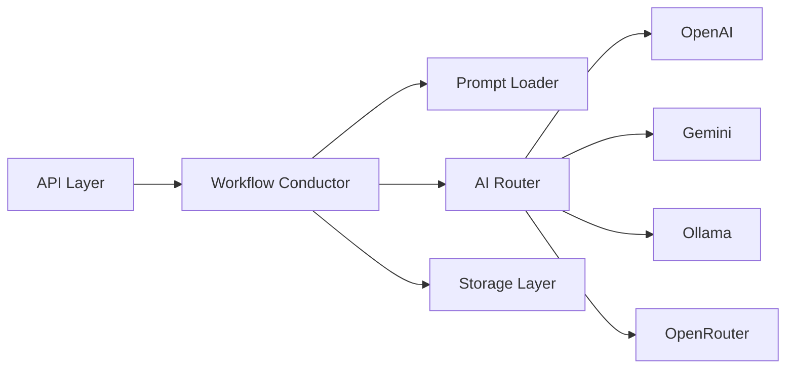

# 😎🔥 API Integration — Operational Workflow Backend

Backend workflow orchestration framework berbasis FastAPI + modular AI routing.

Dirancang untuk:
- rapid API experimentation
- AI provider orchestration
- workflow-based backend development
- scalable modular architecture
- AI-agent friendly collaboration

---

# ✨ Highlights

- ⚡ FastAPI modular backend
- 🤖 Multi-provider AI routing
- 🔄 Auto-failover AI provider
- 🧠 Workflow conductor architecture
- 📦 Prompt-based orchestration
- 🛡️ AI coding governance docs
- 🧪 Beginner-friendly testing flow
- 📈 Evolution-ready structure

---

# 🧠 System Philosophy

Project ini dibangun dengan mindset:

> "workflow first, provider agnostic, orchestration ready" 😎🔥

Artinya:
- business logic tidak terkunci ke 1 AI provider
- workflow dipisah dari transport layer
- prompt dipisah dari code
- storage dipisah dari orchestration
- scaling dilakukan secara bertahap tanpa overengineering

---

# 🚀 Quick Start

## 1. Clone Repository

```bash
git clone https://github.com/sohibwong102-pixel/API_Integration.git
cd API_Integration
```

---

## 2. Setup Virtual Environment

```bash
python3 -m venv .venv
source .venv/bin/activate
```

Windows:

```powershell
.venv\Scripts\activate
```

---

## 3. Install Dependencies

```bash
pip install fastapi uvicorn requests
```

---

## 4. Run Server

```bash
python main.py
```

Server:

```txt
http://127.0.0.1:8000
```

Swagger Docs:

```txt
http://127.0.0.1:8000/docs
```

---

# 🧪 API Testing

## POST `/api/issue-summary`

```bash
curl -X POST \
  -H "Content-Type: application/json" \
  -d '{"text":"backend deploy gagal setelah update middleware"}' \
  http://127.0.0.1:8000/api/issue-summary
```

Example response:

```json
{
  "summary": "Deployment issue related to middleware conflict."
}
```

---

## GET `/api/history`

```bash
curl http://127.0.0.1:8000/api/history
```

---

# 🏗️ Architecture Overview



---

# 📁 Project Structure

```txt
API_Integration/
├── api/                # FastAPI routes & schemas
├── core/               # settings & centralized configs
├── workflows/          # workflow orchestration layer
├── prompts/            # prompt templates
├── services/
│   └── ai/             # modular AI provider system
├── storage/            # local persistence layer
├── DOCS/               # governance & architecture docs
├── analytics_projects/ # technical analysis & scaling docs
├── main.py
└── README.md
```

---

# 🤖 AI Provider System

Project ini menggunakan modular provider architecture.

Supported providers:

- OpenAI
- Gemini
- Ollama
- OpenRouter
- Mock Provider

Routing system mendukung:

- provider switching
- fallback chain
- centralized response normalization
- orchestration abstraction

---

# 🧩 Workflow Design

Setiap workflow bertugas sebagai:

- conductor
- orchestrator
- integration coordinator

Workflow TIDAK boleh:

- langsung handle database logic berat
- langsung handle provider internals
- hardcode prompt
- bypass routing layer

Ini menjaga architecture tetap scalable 😎🔥

---

# 🛡️ AI Coding Governance

Repo ini dibuat agar compatible dengan AI Coding Agent seperti:

- Cline
- Roo Code
- Antigravity
- Cursor
- OpenAI Codex

Semua governance docs tersedia di:

```txt
DOCS/
```

Important docs:

- `SYSTEM_ARCHITECTURE.md`
- `DEVELOPMENT_PLAYBOOK.md`
- `ORCHESTRATION_BLUEPRINT.md`
- `API_USABILITY_RULES.md`
- `AI_PROVIDER_ROUTING_GUIDE.md`

---

# 📈 Evolution Ready

Architecture dirancang untuk migrasi bertahap:

| Current | Future Evolution |
|---|---|
| JSON Storage | PostgreSQL |
| Sync Flow | Async Queue |
| Single Workflow | Multi Workflow Engine |
| Local Router | Distributed Orchestrator |
| Basic Logging | Full Observability |

---

# 🎯 Why This Repo Exists

Karena banyak backend AI project:

- terlalu overengineered 😭
- terlalu tightly coupled 😭
- provider lock-in 😭
- prompt hardcoded 😭
- susah diskalakan 😭

Repo ini mencoba jadi:

> lightweight orchestration foundation

buat experimentation, scaling, dan workflow evolution 😎🔥

---

# 👨‍💻 Built For

Cocok untuk:

- AI backend builders
- workflow engineers
- automation developers
- orchestration experimenters
- AI-agent collaborative development

---

# 📜 License

MIT License

---

# 😎 FINAL WORD

System boleh scale 😎🔥

Team boleh gede 😎🔥

TAPI:

unsur kegoblinan tidak boleh padam 😭🔥
