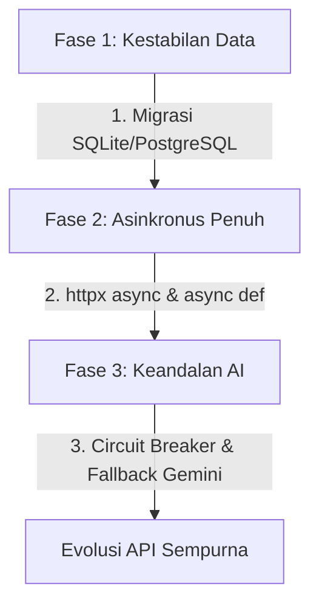

# 📉 ARCHITECTURAL BOTTLENECKS & EVOLUTIONARY LIMITATIONS
> **Laporan Analisis Hambatan Evolusi Kode - `summary_endpoint`**
>
> **Dipersiapkan oleh:** Antigravity (Advanced Agentic Coding AI)  
> **Target Analisis**: Seluruh Kode Sumber Python (`main.py`, `api/routes.py`, `workflows/issue_summary.py`, `services/ai_service.py`, `storage/local_storage.py`, `prompts/loader.py`)  
> **Tujuan**: Mengidentifikasi hutang teknis (*technical debt*), potensi kegagalan performa (*performance bottleneck*), dan hambatan struktural yang dapat menyulitkan proyek untuk berevolusi (*evolve*) di masa depan saat volume pengguna meningkat.

---

## 🧭 1. Ringkasan Eksekutif (Executive Summary)

Meskipun saat ini kode berjalan dengan sangat bersih, modular, dan terstruktur rapi untuk skala kecil (penggunaan lokal/satu developer), hasil analisis mendalam menemukan **5 hambatan struktural utama** yang akan menjadi tembok penghalang ketika proyek ini mulai melayani integrasi intensitas tinggi.

Masalah terbesar berakar pada **Operasi File I/O Sinkronus Tunggal** yang rentan terhadap kebocoran data (*data race conditions*), **klien HTTP yang memblokir thread**, dan **tidak adanya mekanisme ketahanan kegagalan (fallback)** pada layer kecerdasan buatan.

---

## 🔍 2. Analisis File-by-File & Faktor Penghambat Evolusi

### 🚨 1. `storage/local_storage.py` (Hambatan Level: CRITICAL - Sangat Tinggi)

Berkas ini mengelola penyimpanan riwayat pengerjaan keluhan ke file tunggal `storage/history.json`.

```python
# Potongan Kode Bermasalah (storage/local_storage.py:L70-L87)
records = cls.get_all_records() # 1. Membaca seluruh isi file ke memory
...
records.append(new_record)
with open(DB_FILE, "w", encoding="utf-8") as f:
    json.dump(records, f, indent=4, ensure_ascii=False) # 2. Menulis ulang seluruh isi list ke disk
```

#### 🚫 Mengapa Menghambat Evolusi di Masa Depan?
1. **Thread-Blocking I/O (Starvation)**: Penggunaan metode `open` bawaan Python bersifat sinkronus. Saat server menerima request tinggi bersamaan, thread event loop FastAPI akan dipaksa mengantre menunggu operasi disk selesai, menurunkan performa secara eksponensial.
2. **Kondisi Balapan Data (Data Race Conditions / JSON Lock)**: Jika dua request masuk secara bersamaan, keduanya akan membaca list JSON yang sama di saat yang sama, memformat datanya, lalu menulis kembali secara bergantian. **Request kedua akan menimpa data dari request pertama**, mengakibatkan data transaksi hilang selamanya (*lost update anomaly*).
3. **Pembengkakan Memori (Memory Bloat)**: Karena sistem membaca dan menulis seluruh daftar riwayat secara utuh ke RAM setiap kali ada entri baru, jika file JSON membengkak menjadi 100.000 log, pemrosesan API akan menjadi sangat lambat dan memakan RAM server hingga crash.

---

### 🚨 2. `services/ai_service.py` (Hambatan Level: HIGH - Tinggi)

Berkas ini mengelola integrasi dengan model kecerdasan buatan lokal Ollama `qwen2.5:1.5b`.

```python
# Potongan Kode Bermasalah (services/ai_service.py:L157-L165)
response = requests.post(
    url,
    json={"model": model_ai, "prompt": prompt, "stream": False},
    timeout=30.0
)
```

#### 🚫 Mengapa Menghambat Evolusi di Masa Depan?
1. **Synchronous Blocking Network Client**: Library `requests` melakukan operasi jaringan secara sinkronus. Di dalam FastAPI, hal ini memaksa server mengalokasikan thread eksternal (`anyio`) untuk setiap panggilan AI. Ini tidak efisien dibanding menggunakan library asinkronus murni.
2. **Single Point of Failure (SPOF - Tiada Model Cadangan)**: Fungsi pabrik `get_ai_service()` mengembalikan kelas `QwenALocalServices` yang bergantung 100% pada instance Ollama di `localhost`. Jika Ollama macet, mati, atau kehabisan memori GPU lokal, seluruh API mati total. Tidak ada logika *circuit breaker* atau *auto-failover* ke layanan cloud (seperti Google Gemini API dengan kunci API) secara otomatis.

---

### 🚨 3. `workflows/issue_summary.py` (Hambatan Level: MEDIUM - Sedang)

Berkas orkestrasi bisnis utama untuk merangkum isu.

```python
# Potongan Kode Bermasalah (workflows/issue_summary.py:L53)
template = load_prompt_template("issue_summary.txt")
```

#### 🚫 Mengapa Menghambat Evolusi di Masa Depan?
1. **Kopling Nama Berkas Prompt (Hardcoded Prompt Template)**: Nama file `"issue_summary.txt"` ditulis keras (*hardcoded*) di dalam alur logika Python. Jika di masa depan Anda ingin menerapkan *A/B Testing* untuk beberapa prompt berbeda atau berganti gaya bahasa sesuai jenis keluhan, Anda terpaksa harus mengubah file kode program utama.
2. **Aliran Sinkronus Monolitik**: Seluruh metode `.execute()` berjalan secara sinkron. Hal ini menyulitkan integrasi asinkron tingkat tinggi, seperti mengirimkan ringkasan secara simultan ke beberapa layanan eksternal (Slack webhook, email, database audit) tanpa memperlambat waktu respon user.

---

### 🚨 4. `prompts/loader.py` (Hambatan Level: LOW - Rendah)

Helper untuk memuat berkas prompt `.txt` dari disk komputer.

```python
# Potongan Kode Bermasalah (prompts/loader.py:L41-L43)
with open(file_path, "r", encoding="utf-8") as file:
    return file.read()
```

#### 🚫 Mengapa Menghambat Evolusi di Masa Depan?
* **Redundant Disk I/O**: File prompt dibaca langsung dari disk komputer pada **setiap** request yang masuk. Karena template prompt sangat jarang berubah selama runtime, membaca file teks secara berulang dari disk adalah pemborosan sumber daya I/O yang tidak perlu.

---

### 🚨 5. `api/routes.py` & `main.py` (Hambatan Level: LOW - Rendah)

Layer Routing HTTP FastAPI dan konfigurasi server awal.

```python
# Potongan Kode Bermasalah (api/routes.py:L81)
@router.post("/issue-summary", response_model=IssueResponse)
def create_issue_summary(payload: IssueRequest):
```

#### 🚫 Mengapa Menghambat Evolusi di Masa Depan?
1. **Synchronous Route Handlers**: Seluruh endpoint API didefinisikan sebagai fungsi sinkronus `def` (bukan `async def`). Hal ini membuat FastAPI tidak dapat mengeksekusi request secara asinkron murni pada single thread event loop-nya.
2. **Ketiadaan Config Centric**: Proyek tidak memiliki berkas pengelola konfigurasi terpusat (seperti `.env` atau `config.py` menggunakan `pydantic-settings`). Port host uvicorn, nama model AI, dan path database diletakkan tersebar sebagai nilai mentah di dalam file kode.

---

## 🛠️ 4. Peta Jalan Mitigasi Evolusi Kode (Evolutionary Roadmap)

Untuk menjamin proyek ini dapat berevolusi tanpa hambatan performa, berikut adalah rencana mitigasi terstruktur yang dapat diterapkan secara bertahap:



### 1. Migrasi Database Relasional (Mengatasi Masalah `local_storage`)
* **Solusi**: Mengganti `history.json` dengan database relasional ringan seperti **SQLite** (lokal) atau **PostgreSQL** (skala produksi) menggunakan ORM seperti **SQLAlchemy** atau **Tortoise ORM**.
* **Keuntungan**: Menghilangkan balapan data (*race conditions*) secara total via ACID transactions, mendukung pembacaan cepat via index, dan menghemat memori karena database dibaca per baris bukan seluruh file.

### 2. Migrasi ke Async Python Stack (Mengatasi Masalah `api` & `services`)
* **Solusi**: 
  - Mengubah fungsi router di `routes.py` menjadi `async def`.
  - Mengganti library sinkron `requests` di `ai_service.py` menjadi **`httpx.AsyncClient`** yang asinkronus dan non-blocking.
* **Keuntungan**: Server FastAPI dapat menangani ribuan request bersamaan pada satu thread tunggal dengan efisiensi memori yang luar biasa tinggi.

### 3. Penerapan In-Memory Prompt Cache (Mengatasi Masalah `prompts/loader`)
* **Solusi**: Menggunakan decorator bawaan Python `@functools.lru_cache` pada fungsi `load_prompt_template`.
* **Keuntungan**: Berkas prompt hanya akan dibaca dari disk **sekali saja** saat pertama kali dipanggil, request berikutnya akan langsung dilayani dari memori RAM super cepat.

### 4. Sistem Failover Model AI (Mengatasi SPOF `ai_service`)
* **Solusi**: Mengimplementasikan pola **Circuit Breaker** di dalam `get_ai_service()`. Jika request ke Ollama lokal mengalami timeout 3 kali berturut-turut, sistem otomatis mengalihkan panggilan ke cloud API (Gemini/OpenAI) yang andal.
